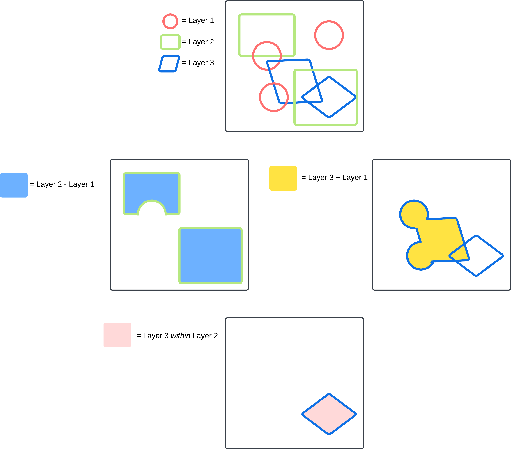
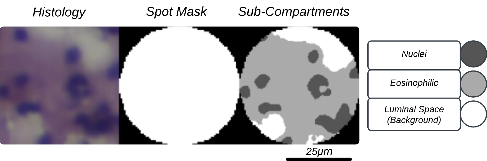
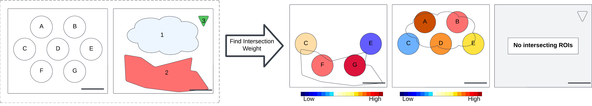

*General Plugins* 
==================

The "general" plugin group includes several plugins which may be applied to several different 
types of spatial --omics techniques. 

CreateAnnotation
-----------------

This CLI includes several operations that can be applied to annotations to create "new" annotations.

This includes operations such as "+" and "-" where you can add or subtract regions covered by different 
annotations to/from each other. On the more advanced side, you can also combine several operations together 
in JSON format and also include property filters and the "within" predicate.

ExportAnnotations
-----------------

This CLI lets users generate annotations in different formats using the "export_annotations" function in *fusion-tools*.

Available export formats include Aperio XML, GeoJSON, and large-image (default in Histomics/DSA). After running this plugin, the 
exported annotations are added to the "files" for that item where they can be downloaded.

FeatureExtraction
------------------

This CLI is used for calculating "pathomics" features for each structure in a slide. These features include 
quantitative measures of morphology (size and shape), color (color channel statistics), texture (by color channel), 
and distance transform (thickness).

 
Sub-compartment extraction is used to separately extract regions corresponding to Hematoxylin and Eosin stains. For more flexibility in other stains 
or to define other sub-compartments, see the "feature_extraction" submodule in *fusion-tools*.

SpatialAggregation
-------------------

Spatial aggregation is used to project properties to intersecting structures. An example 
of this would be for projecting spatial --omics data (*10x Visium* spots or segmented cells with labels) 
to segmented/annotated structures.

